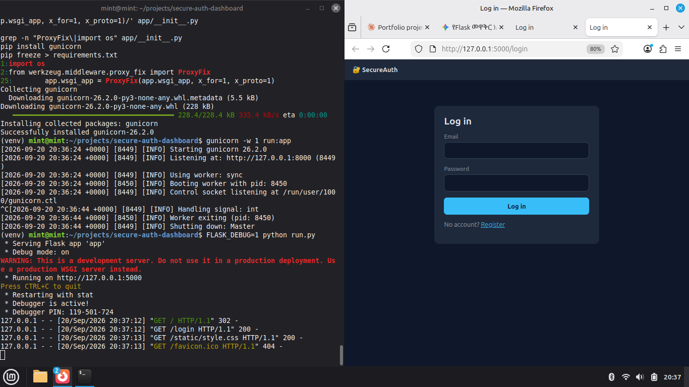
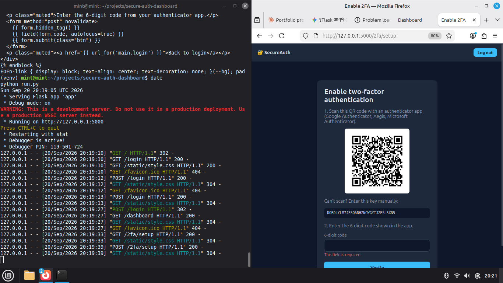

# Secure Auth Dashboard

A Flask web application with secure user authentication: registration, login, and TOTP-based two-factor authentication (2FA), built with security best practices in mind.

**Live demo:** YOUR-LIVE-LINK
(Free hosting: the first load may take ~1 minute, and demo data is reset on restart.)

## Features
- User registration and login with a responsive dashboard
- TOTP two-factor authentication (Google Authenticator, Aegis, etc.) with QR-code setup
- 2FA is only enabled after the user proves the first code works
- Password and code required to disable 2FA

## Security measures
| Threat | Protection |
| --- | --- |
| Password theft | Passwords hashed with Werkzeug (scrypt), never stored in plain text |
| CSRF | Flask-WTF CSRF tokens on every form, including logout |
| Brute force | Flask-Limiter on login, register and 2FA endpoints; 2FA attempts capped per session |
| SQL injection | SQLAlchemy ORM (parameterized queries) |
| XSS | Jinja2 auto-escaping and a strict Content-Security-Policy |
| Clickjacking | X-Frame-Options and frame-ancestors |
| Session fixation | Session cleared on login and logout |
| Open redirect | The `next` parameter accepts same-site relative paths only |
| Cookie theft | HttpOnly, SameSite=Lax, and Secure cookies in production |
| Input abuse | Server-side validation (WTForms) on all inputs |

## Tech stack
Python 3, Flask, Flask-SQLAlchemy (SQLite), Flask-Login, Flask-WTF, Flask-Limiter, PyOTP, qrcode, HTML5/CSS3 (responsive), Gunicorn

## Screenshots
| Login | Register |
| --- | --- |
|  |  |

| 2FA setup | Dashboard |
| --- | --- |
|  |  |

## Run locally
